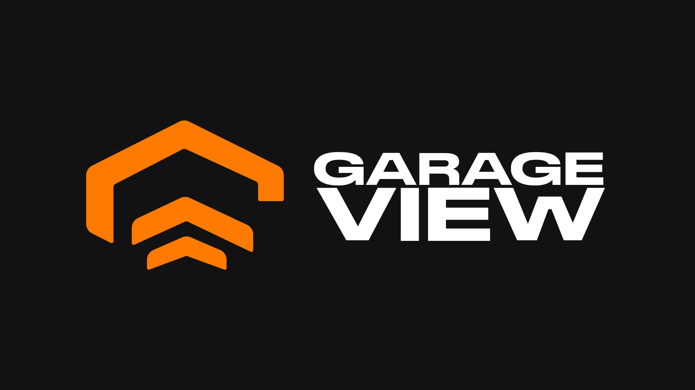
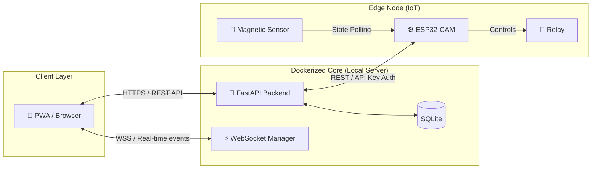

<p align="center">
  <picture>
    <source media="(prefers-color-scheme: dark)" srcset="assets/banner-white-nobg.png"/>
    
  </picture>
</p>

<p align="center">
  <strong>Télésurveillance et contrôle d'accès de porte de garage, 100 % local</strong><br/>
  PWA multi-utilisateurs · Python · ESP32-CAM · Docker · Auto-hébergé
</p>

<p align="center">
  
  
  
  
  
  
</p>

---

## 📖 Abstract

**GarageView** is a secure, self-hosted IoT platform designed to bridge the gap between legacy RF-based hardware (Rolling Code automation systems) and modern web technologies. 

It provides an end-to-end, zero-cloud solution for remote monitoring and access control, strictly adhering to security-first and privacy-by-design principles. The system consists of a hardware edge node (ESP32-CAM) communicating with a containerized backend via a stateless API and real-time WebSockets, all wrapped in a responsive Progressive Web App (PWA).

### 🔐 The Engineering Challenge: Rolling Code Emulation
Modern garage doors (e.g., EcoStar) implement Rolling Code protocols, rendering software-defined radio (SDR) replay attacks ineffective. 
👉 **Solution - Hardware API Bridge**: An ESP32 microcontroller is integrated with a dry-contact relay soldered directly to a paired remote. This acts as a physical abstraction layer, allowing digital API requests to trigger the proprietary RF transmission without compromising the manufacturer's cryptographic implementation.

---

## 🏗️ System Architecture

The architecture is built upon a **Client-Server-Edge** topology, entirely isolated from third-party cloud providers.



---

## 🔒 Security & Hardening (Secure by Design)

Security is not an afterthought; it is baked into the core of the platform to prevent unauthorized physical access.

* **Cryptographic Identity**: Passwords are mathematically hashed using **bcrypt** with individual salting. No plaintext secrets are ever stored or logged.
* **IoT Authentication**: Edge node communication relies on strict API key verification using **constant-time string comparison** (`crypto.timingSafeEqual` equivalent) to mitigate timing attacks.
* **Threat Mitigation**: 
  * Strict Rate Limiting on authentication endpoints to prevent brute-force attacks.
  * Comprehensive Security Headers (CSP, HSTS, X-Frame-Options, X-Content-Type-Options) to neutralize XSS and Clickjacking.
* **Infrastructure Security**: The backend runs inside a hardened Docker container (Read-Only filesystem, `no-new-privileges`, running as a non-root `appuser`).

---

## ⚙️ Tech Stack & Rationale

| Domain | Technology | Rationale |
|--------|-------------|-----------|
| **Backend** | Python 3.13, FastAPI | High-performance asynchronous I/O, auto-generated OpenAPI schemas, strong typing (Pydantic). |
| **Real-time** | WebSockets | Low-latency state synchronization across all connected clients. |
| **Frontend** | Vanilla JS, PWA | Zero-dependency, lightweight, native-like mobile experience. |
| **Database** | SQLite, SQLAlchemy | File-based, ACID-compliant persistence layer (perfect for edge computing). |
| **Firmware** | C++ (Arduino Core) | Low-level hardware control (GPIO, Camera buffer) and memory management. |
| **DevOps** | Docker, Docker Compose | Reproducible environments, dependency isolation, and simplified deployment. |

---

## 🎨 UI / UX Philosophy

The interface follows a strict **Dark Mode** design language, optimized for low-light environments (e.g., using the app from a car at night). 
* **60-30-10 Rule**: 60% deep blacks (`#121212`), 30% neutral grays, 10% accent color (`#FF7A00` Amber).
* **Cognitive Load Reduction**: Red and Green colors are strictly reserved for the binary state of the door (Open/Closed) to ensure instantaneous visual feedback.

---

## 🚀 Deployment (Quick Start)

The environment is fully containerized.

```bash
# 1. Clone the repository
git clone https://github.com/ton-username/GarageView.git
cd GarageView

# 2. Configure environment
# Ensure a .env file is present with GARAGE_DEFAULT_PWD and ESP32_API_KEY

# 3. Spin up the infrastructure
docker-compose up --build -d
```
> The API will be exposed on `http://127.0.0.1:8000`.

---

## 📁 Repository Structure

```text
GarageView/
├── backend/             # FastAPI asynchronous core, SQLAlchemy models & UI
├── arduino/             # ESP32 C++ firmware (Hardware abstraction layer)
├── assets/              # UI graphics and static media
├── docker-compose.yml   # Infrastructure as Code (IaC) configuration
└── README.md
```

---

*This project is built as a technical showcase of Full-Stack Engineering, IoT integration, and Applied Security.*
